# Snake Game - Classic Arcade Experience

## 🎮 Game Flow Diagram

```mermaid
graph TD
    A[🚀 Game Start] --> B{Game Started?}
    B -->|No| C[Show Start Button]
    B -->|Yes| D[Initialize Snake & Food]
    
    C --> E[User Clicks Start]
    E --> F[Set Direction: Right]
    F --> D
    
    D --> G[Game Loop Active]
    G --> H{Game Paused?}
    H -->|Yes| I[Show Pause Overlay]
    H -->|No| J[Move Snake]
    
    I --> K[User Resumes]
    K --> J
    
    J --> L{Wall Collision?}
    J --> M{Self Collision?}
    J --> N{Food Eaten?}
    
    L -->|Yes| O[💀 Game Over]
    M -->|Yes| O
    N -->|Yes| P[🍎 Grow Snake]
    N -->|No| Q[Remove Tail]
    
    P --> R[Increase Score]
    R --> S[Generate New Food]
    S --> T{Score % 50 = 0?}
    T -->|Yes| U[⚡ Increase Speed]
    T -->|No| V[Continue Game]
    U --> V
    Q --> V
    
    V --> W{High Score?}
    W -->|Yes| X[💾 Save High Score]
    W -->|No| Y[Update Display]
    X --> Y
    
    Y --> Z[Render Frame]
    Z --> G
    
    O --> AA[Show Game Over]
    AA --> BB[Play Again?]
    BB -->|Yes| CC[Reset Game]
    BB -->|No| DD[End]
    CC --> B
    
    style A fill:#4CAF50,stroke:#333,stroke-width:3px,color:#fff
    style O fill:#f44336,stroke:#333,stroke-width:3px,color:#fff
    style P fill:#ff9800,stroke:#333,stroke-width:2px,color:#fff
    style R fill:#2196f3,stroke:#333,stroke-width:2px,color:#fff
    style X fill:#9c27b0,stroke:#333,stroke-width:2px,color:#fff
```



## 📋 Project Overview

A classic Snake game built with **React.js** and **HTML5 Canvas**, featuring smooth gameplay, progressive difficulty, and persistent high score tracking. This project demonstrates fundamental game development concepts including game loops, collision detection, state management, and canvas rendering.

## ✨ Key Features

### 🎯 Core Gameplay
- **Smooth Snake Movement**: Fluid directional controls with collision prevention
- **Dynamic Food Generation**: Random food placement avoiding snake body
- **Progressive Difficulty**: Speed increases every 50 points
- **Collision Detection**: Wall and self-collision with immediate game over

### 🎮 User Experience
- **Intuitive Controls**: Arrow keys, WASD, and spacebar support
- **Pause/Resume**: Spacebar to pause mid-game
- **Visual Feedback**: Clear game states and overlays
- **Responsive Design**: Mobile-friendly layout

### 💾 Data Persistence
- **High Score Tracking**: Automatic save to localStorage
- **Session Management**: Score persistence across browser sessions
- **New Record Alerts**: Visual celebration for high score achievements

## 🛠️ Technical Architecture

### Component Structure
```
src/
├── App.js          # Main game component with all logic
├── App.css         # Game-specific styling
├── index.js        # React DOM rendering
└── index.css       # Global styles
```

### State Management
- **Snake Position**: Array of coordinate objects `[{x, y}, ...]`
- **Food Location**: Single coordinate object `{x, y}`
- **Game Direction**: Vector object `{x, y}` for movement
- **Game States**: Boolean flags for started, paused, gameOver
- **Scoring System**: Current score and persistent high score

### Canvas Rendering
- **Grid System**: 20x20 pixel grid cells
- **400x400 Canvas**: Fixed dimensions for consistent gameplay
- **Visual Elements**: Snake segments, food, and grid lines
- **Color Coding**: Different colors for snake head, body, and food

## 🎮 Game Mechanics

### Movement System
- **Direction Vectors**: Mathematical approach using x,y coordinates
- **Collision Prevention**: Cannot reverse into snake body
- **Continuous Movement**: Automatic progression in current direction

### Scoring Algorithm
```javascript
// Base scoring
foodEaten = +10 points

// Speed progression
if (score % 50 === 0 && speed > 100) {
    speed -= 20ms // Faster gameplay
}

// High score logic
if (currentScore > highScore) {
    localStorage.setItem('snakeHighScore', currentScore)
}
```

### Collision Detection
1. **Wall Boundaries**: Check if head position exceeds canvas bounds
2. **Self Collision**: Compare head position with all body segments
3. **Food Detection**: Exact coordinate matching for food consumption

## 🎯 Controls Reference

| Input | Action |
|-------|--------|
| `↑` or `W` | Move Up |
| `↓` or `S` | Move Down |
| `←` or `A` | Move Left |
| `→` or `D` | Move Right |
| `Spacebar` | Pause/Resume |

## 🚀 Getting Started

### Prerequisites
- Node.js (v14 or higher)
- npm or yarn package manager

### Installation
```bash
# Clone the repository
git clone <repository-url>

# Navigate to project directory
cd snake-game

# Install dependencies
npm install

# Start development server
npm start
```

### Build for Production
```bash
# Create optimized build
npm run build

# Serve build locally (optional)
npx serve -s build
```

## 🎨 Styling Approach

### Design Philosophy
- **Beginner-Friendly Appearance**: Simple, clean interface
- **Arial Font Family**: Consistent typography throughout
- **Non-Blue Color Scheme**: Green snake, red food, neutral backgrounds
- **Vanilla CSS**: No external styling frameworks

### Responsive Features
- **Mobile Optimization**: Touch-friendly button sizes
- **Flexible Layout**: Adapts to different screen sizes
- **Readable Typography**: Appropriate font sizes for all devices

## 🔧 Configuration Options

### Game Constants
```javascript
const GRID_SIZE = 20;        // Pixel size of each grid cell
const CANVAS_WIDTH = 400;    // Canvas width in pixels
const CANVAS_HEIGHT = 400;   // Canvas height in pixels
const INITIAL_SPEED = 200;   // Starting game speed (ms)
const SPEED_INCREMENT = 20;  // Speed increase per level
const POINTS_PER_FOOD = 10;  // Score per food item
```

### Customization
- Modify grid size for different gameplay feel
- Adjust speed progression for difficulty curve
- Change color scheme in CSS variables
- Alter scoring system in game logic

## 🐛 Known Limitations

- **Single Player Only**: No multiplayer functionality
- **Fixed Canvas Size**: Not dynamically resizable
- **Basic Graphics**: Simple rectangular shapes
- **No Sound Effects**: Silent gameplay experience

## 🔮 Future Enhancements

### Potential Features
- [ ] Sound effects and background music
- [ ] Multiple difficulty levels
- [ ] Power-ups and special food items
- [ ] Multiplayer support
- [ ] Custom themes and skins
- [ ] Leaderboard system
- [ ] Mobile touch controls

### Technical Improvements
- [ ] Dynamic canvas resizing
- [ ] Smooth animations and transitions
- [ ] Performance optimizations
- [ ] Unit test coverage
- [ ] TypeScript migration option

## 📊 Performance Metrics

- **Frame Rate**: 60 FPS target with requestAnimationFrame
- **Memory Usage**: Minimal state management
- **Load Time**: < 1 second on modern browsers
- **Bundle Size**: Lightweight React application

## 🤝 Contributing

1. Fork the repository
2. Create feature branch (`git checkout -b feature/amazing-feature`)
3. Commit changes (`git commit -m 'Add amazing feature'`)
4. Push to branch (`git push origin feature/amazing-feature`)
5. Open Pull Request

## 📄 License

This project is open source and available under the [MIT License](LICENSE).

## 🙏 Acknowledgments

- Classic Snake game inspiration from Nokia mobile phones
- React.js community for excellent documentation
- HTML5 Canvas API for rendering capabilities
- Create React App for project scaffolding

---

**Built with ❤️ using React.js and HTML5 Canvas**

*Enjoy the nostalgic gaming experience!* 🐍🎮
